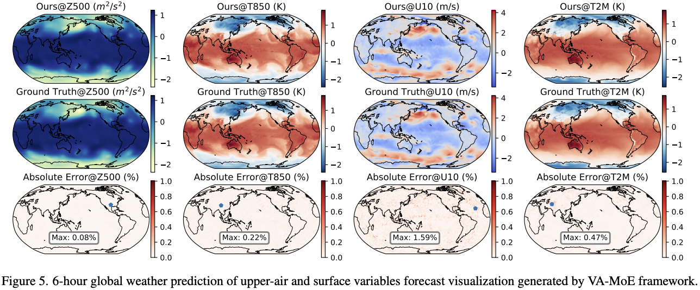

# VA-MoE (ICCV2025)

 

This repository contains the code used for "VA-MoE: Variables-Adaptive Mixture of Experts for
Incremental Weather Forecasting" \[[paper](https://arxiv.org/abs/2412.02503)\]

This paper presents Variables Adaptive Mixture of Experts (VAMoE), a novel framework for incremental weather forecasting that dynamically adapts to evolving spatiotemporal patterns in real time data. Traditional weather prediction models often struggle with exorbitant computational expenditure and the need to continuously update forecasts as new observations arrive. VAMoE addresses these challenges by leveraging a hybrid architecture of experts, where each expert specializes in capturing distinct subpatterns of atmospheric variables (temperature, humidity, wind speed). Moreover, the proposed method employs a variable adaptive gating mechanism to dynamically select and combine relevant experts based on the input context, enabling efficient knowledge distillation and parameter sharing. This design significantly reduces computational overhead while maintaining high forecast accuracy. Experiments on real world ERA5 dataset demonstrate that VAMoE performs comparable against SoTA models in both short term (1 days) and long term (5 days) forecasting tasks, with only about 25% of trainable parameters and 50% of the initial training data.

## Framework

 


## Files

```plain
├── config
│   └── vamoe.yaml
├── export_DDP_vars.sh
├── inference.py
├── networks
│   ├── dit_moe.py
│   ├── gnn_load.py
│   ├── graphcast.py
│   ├── graph_tools.py
│   ├── __init__.py
│   ├── l2_loss.py
│   ├── moe_layer.py
│   ├── VAMoEBlock.py
│   ├── VAMoE.py
│   ├── test.py
│   └── vit_fast.py
├── README.md
├── test.py
├── test.sh
├── train_n32_hkust.sh
├── train.py
├── train.sh
└── utils
    ├── darcy_loss.py
    ├── data_loader_npyfiles.py
    ├── date_time_to_hours.py
    ├── img_utils.py
    ├── logging_utils.py
    ├── metrics.py
    ├── weighted_acc_rmse.py
    └── YParams.py
```

## Training:

The model is trained on ERA5 reanalysis data on single levels \[ [Hersbach 2018](10.24381/cds.adbb2d47) \] and pressure levels \[ [Hersbach 2018](10.24381/cds.bd0915c6) \]. Mean and Std are collected from \[[FengWu](https://github.com/OpenEarthLab/FengWu)\] repo.

The data directory is organized as follows:

```plain
├── data
│   ├── single
│   │   ├── 1979
│   │   │   ├── 1979-01-01
│   │   │   │   ├─ 00:00:00-msl.npy
│   │   │   │   ├─ 00:00:00-t2m.npy
│   │   │   │   ├─ 00:00:00-u10.npy
│   │   │   │   ├─ 00:00:00-v10.npy
│   │   │   │   ├─ ...
│   │   │   │   ├─ 23:00:00-msl.npy
│   │   ├── 1980
│   │   ├── ...
│   │   ├── 2018
│   ├── 1979
│   │   ├── 1979-01-01
│   │   │   ├─ 00:00:00-q-50.0.npy
│   │   │   ├─ ...
│   │   │   ├─ 00:00:00-q-1000.0.npy
│   │   │   ├─ 00:00:00-r-50.0.npy
│   │   │   ├─ ...
│   │   │   ├─ 23:00:00-z-1000.0.npy
│   │   ├── 1979-01-02
│   │   ├── ...
│   │   ├── 1979-12-31
│   ├── 1980
│   ├── ...
│   ├── 2018
```


Run training with 

```
bash train.sh
```


## Inference:

Run inference using

```
bash test.sh
```

## Experiments:

<!-- {width="70%"}  -->


## Visualization:

 


## References:

If you find this work useful, cite it using:
```
@inproceedings{vamoe,
  title={VA-MoE: Variables-Adaptive Mixture of Experts for Incremental Weather Forecasting},
  author={Chen, Hao and Tao, Han and Song, Guo and Zhang, Jie and Yu, Yunlong and Dong, Yonghan  and Bai, Lei},
  booktitle={Proceedings of the IEEE/CVF International Conference on Computer Vision (ICCV)},
  year={2025}
}
```


